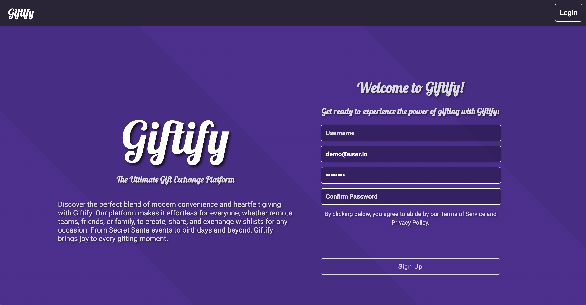
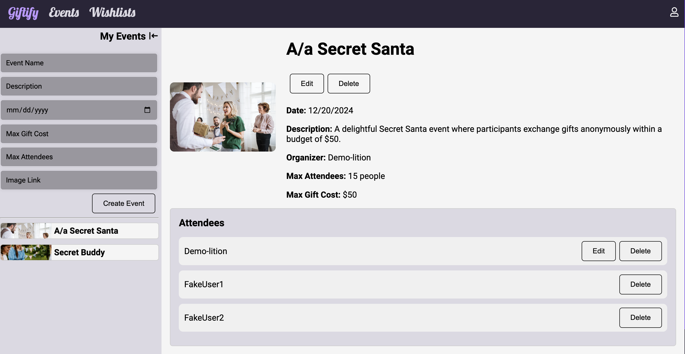

# Giftify

> Giftify is a comprehensive gifting platform that enables users to create, share, and exchange wishlists for various occasions. With a focus on user engagement, convenience, and community interaction, Giftify aims to revolutionize the way people celebrate special events and share meaningful gifts with friends, family, and colleagues.
> Live demo [_here_](https://giftify-bgc5.onrender.com). <!-- If you have the project hosted somewhere, include the link here. -->

## Table of Contents

- [General Info](#general-information)
- [Technologies Used](#technologies-used)
- [Features](#features)
- [Screenshots](#screenshots)
- [Setup](#setup)
- [Usage](#usage)
- [Project Status](#project-status)
- [Room for Improvement](#room-for-improvement)
- [Acknowledgements](#acknowledgements)
- [Contact](#contact)
<!-- * [License](#license) -->

## General Information

Giftify provides users with a platform to create and manage wishlists for various events and occasions. It aims to simplify the process of gift-giving by allowing users to share their wishlists with friends and family, making it easier for others to find the perfect gift.

## Technologies Used

- React
- Redux
- Node.js
- Express
- PostgreSQL

## Features

- User authentication and authorization
- Wishlist creation and management
- Event creation and management

## Screenshots

<!-- If you have screenshots you'd like to share, include them here. -->

## Setup

To run Giftify locally, follow these steps:

- Install dependencies using `npm install`.
- Set up your PostgreSQL database and configure the `.env` file with your database credentials.
- Run the development server using `npm start`.

## Usage

Giftify allows users to:

- Create an account and log in.
- Create and manage wishlists for different events.
- Invite friends and family to view and contribute to their wishlists.

## Project Status

Giftify is currently _in development_. It is functional and usable, but there are ongoing improvements and features being added.

## Room for Improvement

- Improve user interface and experience.
- Enhance search and recommendation features.
- Implement additional social sharing options.
- Optimize performance and scalability.

## Acknowledgements

- This project was inspired by the desire to simplify the gift-giving process and enhance the experience of both gift givers and recipients.
- Special thanks to the developers and contributors of the libraries and tools used in this project.

## Contact

Created by [Ramon Barros](https://github.com/ramonpbarros) - feel free to contact me!
